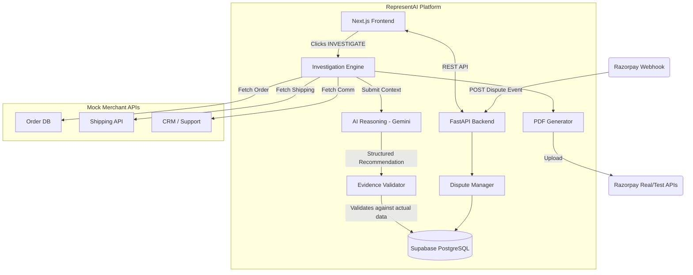

# RepresentAI Architecture

## Overview

RepresentAI is an AI-powered dispute investigation platform designed for merchants. It integrates with Razorpay via webhooks to ingest dispute events, orchestrates an AI-driven investigation workflow against various (mocked) merchant systems, and recommends structured actions (`FIGHT`, `ACCEPT`, `HUMAN_REVIEW`).

## System Architecture

## Tech Stack

- **Frontend:** Next.js (TypeScript), Tailwind CSS.
- **Backend:** Python, FastAPI, Pydantic, ReportLab.
- **Database:** Supabase (PostgreSQL).
- **AI Model:** Gemini 3.1 Pro (structured outputs).

## Workflow

1. **Detection:** Razorpay webhook triggers, dispute is persisted in the database.
2. **Dashboard Notification:** The dispute appears in the Next.js UI.
3. **Investigation Trigger:** The merchant clicks `INVESTIGATE`.
4. **Data Gathering:** Backend fetches data from Mock Merchant APIs via tools.
5. **AI Reasoning:** The gathered evidence is supplied to Gemini. The model outputs a structured decision (`FIGHT`, `ACCEPT`, `HUMAN_REVIEW`) mapped to evidence IDs.
6. **Validation:** The Evidence Validator checks the AI's claims strictly against actual DB/Mock data to prevent hallucination.
7. **Response & PDF:** A professional PDF is generated (via ReportLab).
8. **Final Decision:** The merchant approves the recommendation and uploads the document to Razorpay.
